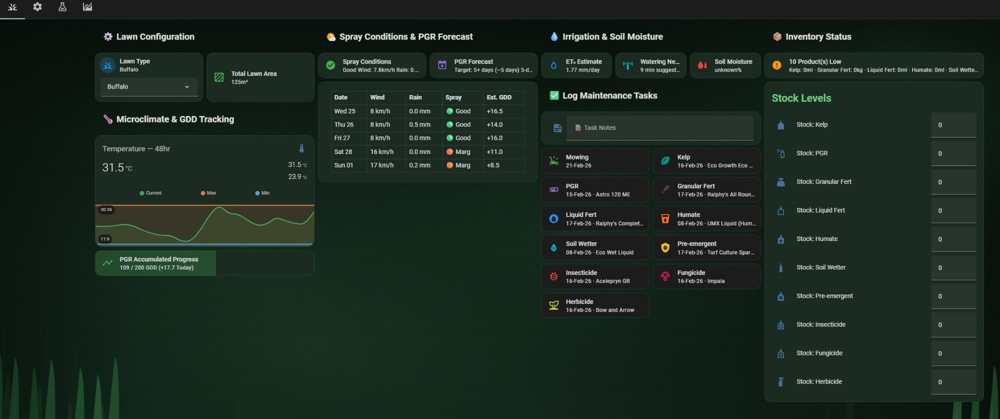
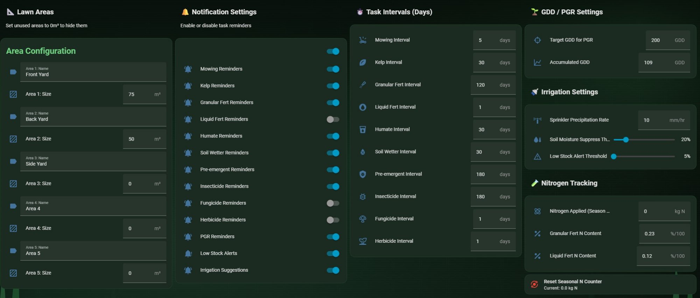
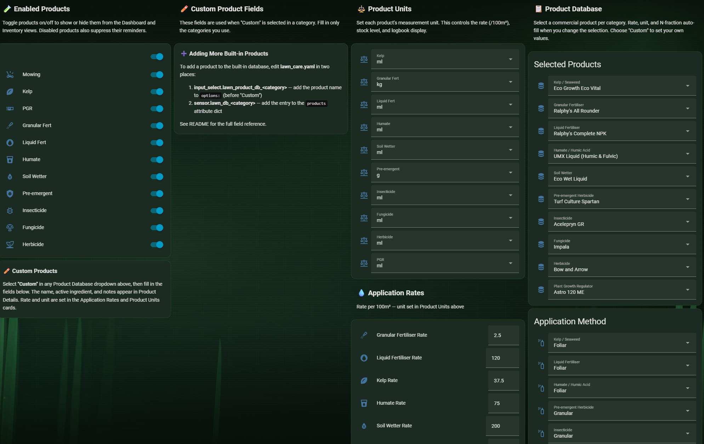

# 🌱 Perth Turf Management System for Home Assistant

> **Comprehensive lawn care automation for warm-season turf on Perth's sandy soils.**
> GDD-driven PGR scheduling, inventory tracking, ET₀ irrigation estimates, spray condition forecasting, and a dark-themed Mushroom dashboard — all in a single HA package file.


**[Jump to Installation Guide →](#-installation)**

---

## Screenshots

### Dashboard


### Settings


### Products


### Season Review


---

## What's New in v3.7

**🐛 CRITICAL FIX: Jinja2 TemplateSyntaxError** — Product names containing apostrophes (e.g. `Ralphy's`) broke Jinja2 template parsing. All such strings now use double quotes inside dict literals. This also fixes the Product Details card showing `unknown` / `None`.

**📋 Full Product & Rate Refresh** — All 106 products cross-checked against master CSV. Database now covers 10 categories with accurate application rates.

**🛒 21 New Products Added:**

| Category | Added | Products |
|---|---|---|
| Granular Fert | +9 | Baileys SG Maintain/Elite/Renovate, Turfect Energy, Energy Max, 3.1.1 split into Grosorb + Granulated |
| Liquid Fert | +5 | Baileys Turfect Rapid Green/Green Plus, Plant Doctor Liquid Iron/Max Green, Floratine Knife Plus |
| Humate | +3 | Plant Doctor Stimulizer/Humic Acid Powder, Ralphy's Unleash |
| Soil Wetter | +3 | Floratine Propel/Retain Pro, Plant Doctor Nature Soils Wetter |
| Kelp / Bio-stim | +3 | Plant Doctor Seaweed Secrets/Activ8mate, Eco Growth Eco Vital |
| Humic (existing) | — | Baileys Turfect Humic (was missing) |

**📊 Key Rate Corrections:** NitroKelp 150–300ml (was 200–400), Seacharge 100ml (was 100–200), Refresh 50–100ml (was 100–200), Eco Wet Liquid 150–200ml (was 200–500), Eco Humate 200ml (was 100–200), Quantum H 50–75ml (was 50–100), Eco Prime Emerald 2.5kg (was 2.5–5.0), Baileys 4.1.1 1.5–3.0kg (was 2.0), Showtime 200–500ml unified.

## What Was New in v3.6

**🛒 Billy Goat Lawns Products Added** — 16 new products scraped from [billygoatlawns.com.au/collections/nutrition](https://www.billygoatlawns.com.au/collections/nutrition), bringing the total database to **85 products** across 10 categories.

| Category | Added | Products |
|---|---|---|
| Granular Fert | +5 | Baileys SureGreen Gold (21.4%N), Lawn Juice RoyalGreen + Mini Prill (20%N, 50% slow-release), ICL ProTurf NPK + HI N |
| Soil Wetter | +3 | Sacoa BioWett Premium, Lawn Juice Hydrate, ICL H2Pro TriSmart |
| Humate | +5 | Lawn Juice Thrive, PGF Carbon King, Eco Growth Eco Humate, Plant Doctor Quantum H, Humate Granules (Leonardite) |
| Kelp | +2 | Lawn Juice Kelp Guard+, PGF SeaGreen Kelp |
| Liquid Fert | +1 | PGF Green Machine (14%N + 6% Fe + 1% Mg) |

**📊 NitroKelp Rate Updated** — Lawn Juice NitroKelp rate corrected from 150–300ml to 200–400ml per 100m² per the Billy Goat Lawns product page.

## What Was New in v3.5

**📋 Complete Product Database Overhaul** — Replaced all 52 products with 69 new Australian turf products sourced from the user's actual product inventory. Every product includes application rate per 100m², active ingredient, application method notes (Water in / Dry on leaf / Depends on target), and nitrogen fraction where known.

| Category | Products | Highlights |
|---|---|---|
| Granular Fert | 20 | LawnPride, 2Spec, Baileys, Eco Prime, Ralphy's, Troforte, Simplot |
| Soil Wetter | 11 | Hydramaxx (liquid + granular), Ralphy's, Hydrolink, Polywet, Eco Wet, Grosorb, PCT adjuvant |
| Insecticide | 8 | Acelepryn (GR + Liquid), Fipronil, Bifenthrin, Echelon Duo (dual-action) |
| Herbicide | 8 | Bow & Arrow, Contra M, Halo-Force (sedge), Tribute, Poa Chek, Fusilade |
| Liquid Fert | 6 | Greenxtra, Showtime, Complete NPK, Turfect, Vigorous Growth+, Tracemaxx |
| Kelp | 5 | Rootmaxx, Kelpxtra, Kelpro, NitroKelp, Seacharge |
| Pre-emergent | 4 | Oxafert (fert+pre-em), Spartan, Barricade, Onset 10GR |
| Fungicide | 4 | Impala, Bumper 625, Dedicate, Chlortan 1040 |
| PGR | 2 | Astro 120 ME (trinexapac-ethyl), Colourmaxx (pigment) |
| Humate | 1 | UMX Liquid (Humic & Fulvic) |

**🐛 Insecticide Method Selector Expanded** — Now includes Granular, Foliar Spray, and Soil Drench (was Granular + Liquid Spray). Matches the diverse application methods of the new insecticide range.

## What Was New in v3.4

**✏️ UI-Editable Custom Products** — Select "Custom" in any product category dropdown and a card appears in the Products view with editable fields for product name, active ingredient, and notes. No YAML editing required — define your own products entirely from the dashboard. The custom name flows through to the Dashboard task cards, Product Details, and logbook entries.

**🎯 Conditional Cards** — Custom product setup cards are hidden by default and only appear when you select "Custom" in that category's dropdown. Keeps the Products view clean when using built-in products.

## What Was New in v3.3

**🏗️ Single-Source Product Database** — Complete architecture refactor. Each category's product dictionary is now defined **once** in a dedicated `sensor.lawn_db_*` template sensor. All consumers (info sensors, auto-fill automations) read from it via `state_attr()`. Adding a product now means editing just **2 lines** (the dict + the dropdown options) instead of 8 copies.

**🧪 Dedicated Products View** — New fourth dashboard tab (`/products`) with all product configuration in one place: Enabled Products toggles, Product Units, Product Database selectors, Application Methods, Product Details, and Application Rates. The Settings view is now cleaner — just areas, notifications, intervals, GDD, irrigation, and nitrogen.

## What Was New in v3.2

**📋 Product Database** — 52 commercial turf products across 10 categories (kelp, granular/liquid fertiliser, humate, soil wetter, pre-emergent, insecticide, fungicide, herbicide, PGR), sourced from Australian-available brands. Select a product from the dropdown and the application rate, unit, and nitrogen fraction auto-populate — no manual lookup needed. Every product includes the active ingredient, application notes, and rate ranges per method. Choose "Custom" in any category to set your own values.

**🔀 Application Method Selectors** — Seven categories with multiple application methods get their own method dropdown (e.g., Foliar vs Soil Drench, Granular vs Liquid Spray, Foliar Spray vs Curative Drench). Changing the method automatically recalculates the suggested rate for that product.

**🔬 Product Info Sensors** — 10 new `sensor.lawn_product_info_*` template sensors expose the selected product's rate range, active ingredient, notes, and unit as HA attributes. The Settings view shows a live **📝 Product Details** summary card.

**📱 Dashboard Product Tags** — Each task grid button now shows the selected product name alongside the last-applied date (e.g., "17-Feb-26 · Primo MAXX"), so you always know what's loaded.

**🔧 Restart Persistence Fix** (v3.2.1) — Removed `initial:` from all 57 entities. Product toggles, lawn type, area names, product selections, unit selectors, and notification toggles now persist across HA restarts.

## What Was New in v3.1

**🧪 Product Toggles** — Enable or disable individual products from the Settings view. Disabled products are hidden from the Dashboard task grid, excluded from the Inventory stock list, and their reminders are automatically suppressed. Products that have never been used show "N/A" instead of a default date.

**⚖️ Configurable Product Units** — Each product now has a unit selector (`ml`, `g`, `L`, `kg`) in Settings. Changing the unit updates the application rate display, stock level, logbook entries, and low-stock alert details everywhere — no YAML editing required. Defaults: `g` for Granular Fert, `ml` for everything else.

**Inline Table Styles** — The 5-day forecast table uses pure inline `style=""` attributes. The `<style>` tag approach was stripped by HA's markdown card sanitiser.

**Jinja2 Whitespace Fix** — Every multi-line Jinja2 template block (76 total) now uses YAML literal scalar (`|`) instead of folded scalar (`>`). Preserves newlines in logbook messages, notification text, and sensor state computations.

## What Was New in v3.0

### Features Added in v3.0

- **📦 Inventory Tracking** — Stock levels for all 10 products auto-deducted when you tap a log button. Configurable low-stock threshold alerts via push notification. Dashboard card shows at-a-glance stock status.

- **💧 ET₀ Irrigation Estimates** — Simplified Hargreaves evapotranspiration model calibrated for Perth's latitude (~31.9°S). Calculates net water demand after subtracting forecast rain and outputs a suggested watering runtime in minutes based on your sprinkler precipitation rate.

- **🌡️ Soil Moisture Integration** — Supports any number of Zigbee/Ecowitt/BLE soil probes. Averages readings across zones. When soil moisture is above your configured threshold, irrigation notifications and watering reminders are automatically suppressed.

- **🧪 Nitrogen Tracking** — Cumulative seasonal nitrogen counter (kg N) auto-increments when you log granular or liquid fertiliser. Configurable N-fraction per product (e.g., `0.20` for a 20-4-11). One-tap seasonal reset script included.

- **📊 Season Review Dashboard** — New third view with 12-month temperature statistics (built-in `statistics-graph`), a dual-axis Nitrogen vs Temperature chart (ApexCharts), 90-day daily GDD bar chart, and a season summary card.

- **🔔 Irrigation & Low Stock Notifications** — Two new toggleable notification automations: daily irrigation suggestions at 5:00 AM (suppressed when soil is wet) and low-stock alerts when any product drops below threshold.

### Improvements in v3.0 over v2.x

- **`service:` → `action:`** — All 50+ action calls migrated to the HA 2024.8+ `action:` key. No more deprecation log warnings.

- **`call-service` → `perform-action`** — All 11 dashboard tap actions migrated. Clean on HA 2025.x.

- **GDD Race Condition Eliminated** — The separate `lawn_gdd_accumulate` (00:00:00) and `lawn_temp_reset_daily` (00:00:30) automations are merged into a single `lawn_daily_gdd_cycle` that runs at 23:59 with ordered actions. No more risk of accumulating a zeroed GDD value on HA restart at midnight.

- **Robust Temperature Guards** — The max/min tracking automations now explicitly reject `unavailable` and `unknown` states before writing. Prevents a sensor dropout from recording `0°C` as your daily extreme.

- **PGR Days-Until Stability** — Now uses the 5-day forecast projection average instead of today's (often-zero overnight) GDD as the divisor. No more `unavailable` state at 1:00 AM.

- **Spray Conditions Icon Fix** — The icon template no longer self-references its own state on first evaluation. Uses the same wind/rain variables inline.

- **Mobile-Friendly Task Grid** — Reduced from 3 columns to 2 columns so cards remain readable on phone screens. `:hover` CSS replaced with `:active` for proper touch feedback.

- **Database Bloat Reduction** — Wrapper template sensors for daily max/min temp removed (redundant with the `input_number` entities). `device_class` and `state_class` applied directly via `customize:`. Recorder exclude snippet provided for ephemeral entities.

---

## Feature Overview

| Feature | What It Does |
|---|---|
| **GDD Tracking** | Automatic Growing Degree Day accumulation. Lawn-type-aware base temperatures: 10°C for C4 (Couch, Kikuyu, Buffalo, Bermuda), 5°C for C3 |
| **PGR Forecasting** | 5-day predictive GDD projection from weather forecast. Estimates the exact date you'll hit your GDD target |
| **Spray Conditions** | Evaluates today's wind + rain as Good/Marginal/Poor. 5-day inline forecast table. "Next spray window" sensor scans 7 days |
| **11 Task Reminders** | Interval-based notifications for: mowing, kelp, granular fert, liquid fert, humate, soil wetter, pre-emergent, insecticide, fungicide, herbicide, PGR — each with an independent on/off toggle |
| **Inventory Tracking** | Stock levels for 10 products. Auto-deducts on log. Low-stock sensor + push alert |
| **ET₀ Irrigation** | Hargreaves ET₀ → net demand (minus forecast rain) → suggested sprinkler minutes |
| **Soil Moisture** | Multi-probe average. Suppresses watering notifications when soil is above threshold |
| **Nitrogen Tracking** | Cumulative seasonal N counter (kg). Auto-increments on granular/liquid fert logs. Configurable N-fraction per product |
| **Multi-Area** | 5 configurable lawn zones with names and sizes. Per-area quantity calculations in logbook entries |
| **Season Review** | 12-month temp trends, N vs temp dual-axis chart, 90-day GDD bar chart, season summary |
| **Product Toggles** | Enable/disable individual products from Settings. Hides from Dashboard, Inventory, and suppresses reminders. Unlogged products show "N/A" |
| **Product Database** | 106 commercial products across 10 categories. Auto-fills rate, unit, N-fraction on selection. Method-aware (Foliar/Drench/Granular/Spot). UI-editable Custom slots. |
| **Product Units** | Per-product unit selector (ml/g/L/kg). Flows through to rates, stock, logbook entries, and alerts — no YAML editing needed |
| **Mobile Dashboard** | 2-column responsive task grid, touch-optimised cards, dark Mushroom theme |

---

## Entity Reference

The package creates the following entities:

| Type | Count | Examples |
|---|---|---|
| `input_boolean` | 24 | `lawn_notify_mowing`, `lawn_notify_low_stock`, `lawn_notify_irrigation`, `lawn_product_mowing`, `lawn_product_kelp`, `lawn_product_pgr` |
| `input_number` | 45 | `lawn_area_1_size`, `lawn_rate_kelp`, `lawn_interval_mowing`, `lawn_stock_kelp`, `pgr_gdd_target`, `lawn_sprinkler_precip_rate`, `lawn_nitrogen_applied_season` |
| `input_datetime` | 11 | `lawn_last_mowing`, `lawn_last_kelp`, `lawn_last_pgr` |
| `input_text` | 36 | `lawn_area_1_name` through `lawn_area_5_name`, `lawn_task_notes`, 30× `lawn_custom_name/ai/notes_*` (UI-editable custom product fields) |
| `input_select` | 28 | `lawn_type`, `lawn_unit_kelp` through `lawn_unit_pgr` (ml/g/L/kg), `lawn_product_db_kelp` through `lawn_product_db_pgr` (product names), `lawn_app_method_kelp` etc. (application methods) |
| Template sensors | 34 | `lawn_gdd_today`, `lawn_spray_conditions`, `lawn_et_estimate`, `lawn_irrigation_minutes`, `lawn_avg_soil_moisture`, `lawn_low_stock_items`, `lawn_pgr_forecast_date`, 10× `lawn_db_*` (single-source product dicts), 10× `lawn_product_info_*` |
| Scripts | 12 | `lawn_log_mowing` through `lawn_log_pgr`, `lawn_reset_nitrogen_season` |
| Automations | 27 | `lawn_temp_track_max`, `lawn_daily_gdd_cycle`, `lawn_pgr_gdd_alert`, 11 task reminders, `lawn_low_stock_alert`, `lawn_irrigation_notify`, 10 product auto-fill, `lawn_first_run_defaults` |

---

## Prerequisites

### Required

- **Home Assistant 2024.8+** (uses `action:` syntax, `weather.get_forecasts`, `perform-action` tap actions)
- **Weather integration** with daily forecasts — [WeatherFlow](https://www.home-assistant.io/integrations/weatherflow/), [Bureau of Meteorology](https://github.com/bremor/bureau_of_meteorology), [OpenWeatherMap](https://www.home-assistant.io/integrations/openweathermap/), or similar
- **Temperature sensor** providing °C (any local or weather-station sensor)
- **HA Companion App** (iOS or Android) for push notifications

### Required HACS Frontend

Install these via [HACS](https://hacs.xyz/) → Frontend:

| Card | Purpose | Link |
|---|---|---|
| **Mushroom Cards** | Core UI card library (template cards, select cards) | [GitHub](https://github.com/piitaya/lovelace-mushroom) |
| **Mini Graph Card** | 48-hour temperature sparkline | [GitHub](https://github.com/kalkih/mini-graph-card) |
| **card-mod** | CSS theming (dark green theme, progress bar gradients) | [GitHub](https://github.com/thomasloven/lovelace-card-mod) |

### Optional HACS Frontend

| Card | Purpose | Link |
|---|---|---|
| **ApexCharts Card** | Season Review dual-axis charts (View 3) | [GitHub](https://github.com/RomRider/apexcharts-card) |
| **layout-card** | Auto-collapsing grid columns for advanced responsive layouts | [GitHub](https://github.com/thomasloven/lovelace-layout-card) |

### Optional Hardware

- **Soil moisture probes** — Ecowitt WH51 (via Ecowitt integration or GW1000 gateway), Xiaomi HHCCJCY01 (BLE), or any Zigbee sensor via ZHA/Z2M
- **Smart irrigation controller** — Rachio, Hydrawise, or generic relay-controlled solenoid valves

---

## 🚀 Installation

### Step 1 — Enable Packages

In your `configuration.yaml`, ensure packages are enabled:

```yaml
homeassistant:
  packages: !include_dir_named packages
```

Create the directory if it doesn't exist:

```bash
mkdir -p config/packages
```

### Step 2 — Copy the Package File

Copy `lawn_care.yaml` into `config/packages/`:

```
config/
├── configuration.yaml
├── packages/
│   └── lawn_care.yaml       ← backend (entities, sensors, scripts, automations)
└── www/
    └── turf_bg.svg           ← optional background image
```

### Step 3 — Configure Your Three Entity IDs

Open `lawn_care.yaml` and update the three YAML anchors near the top of the file:

```yaml
# ────────────────────────────────────────────────────────────
# CONFIGURATION ANCHORS — Edit these three lines only
# ────────────────────────────────────────────────────────────
package.lawn_temp_sensor: &temp_sensor sensor.YOUR_TEMP_SENSOR
package.lawn_notify_service: &notify_service notify.mobile_app_YOUR_PHONE
package.lawn_weather: &weather_forecast weather.YOUR_WEATHER_ENTITY
```

These anchors handle `entity_id:` and `target:` references automatically. However, **Jinja2 template strings** (`{{ }}`) also contain hardcoded entity IDs that need updating. Search the file for `⚙️ USER-CONFIG` to find all locations — there are approximately 8 places in the automations section where the temperature sensor entity ID appears inside a template string.

| Setting | Default Value | Change To |
|---|---|---|
| Temperature sensor | `sensor.weatherflow_sensors_temperature` | Your local temp sensor (must provide °C) |
| Notify service | `notify.mobile_app_marcs_iphone` | Your mobile app notify service |
| Weather entity | `weather.weatherflow_forecast_home` | Your weather forecast entity (must support `weather.get_forecasts` with `type: daily`) |

### Step 4 — Add Recorder Excludes (Recommended)

Merge the contents of `recorder_exclude.yaml` into your `configuration.yaml` to prevent database bloat from ephemeral entities:

```yaml
recorder:
  exclude:
    entities:
      # Daily temp trackers — reset every night, no historical value
      - input_number.lawn_temp_daily_max
      - input_number.lawn_temp_daily_min
      # Forecast sensor — stores full 7-day JSON blob on every hourly update
      - sensor.lawn_weather_forecast_custom
```

If you already have a `recorder:` block, merge the `entities:` list into your existing excludes.

### Step 5 — Install the Dashboard

**Option A — YAML Mode Dashboard** (recommended for version control):

Copy `lovelace_dashboard.yaml` to your config directory and add to `configuration.yaml`:

```yaml
lovelace:
  mode: yaml
  dashboards:
    lovelace-turf:
      mode: yaml
      title: Turf Management
      icon: mdi:grass
      show_in_sidebar: true
      filename: lovelace_dashboard.yaml
```

**Option B — UI Mode Dashboard:**

1. Go to **Settings → Dashboards → Add Dashboard**
2. Choose **"Start with an empty dashboard"**
3. Open the dashboard, click the **⋮ menu → Raw configuration editor**
4. Paste the entire contents of `lovelace_dashboard.yaml`
5. Click **Save**

### Step 6 — Background Image (Optional)

The dashboard theme references `/local/turf_bg.svg` as a background. Place your SVG at `config/www/turf_bg.svg`. If you don't have one, the dark theme works fine without it — just remove or comment out the `background:` block from each view in the dashboard YAML.

### Step 7 — Restart and Verify

1. **Restart Home Assistant** to load the package
2. Go to **Developer Tools → States**
3. Filter for `lawn_` — you should see all entities listed
4. Verify `sensor.lawn_weather_forecast_custom` has a `forecast` attribute (may take up to 1 hour for the first fetch)

---

## Post-Install Configuration

### Enable Your Products

The **Settings** tab starts with a **🧪 Enabled Products** section. All 11 products are enabled by default. Toggle off any product you don't use — it will be hidden from the Dashboard task grid, removed from the Inventory stock list, and its reminder notifications will be suppressed. You can re-enable at any time.

### Set Your Product Units

Below the product toggles is the **⚖️ Product Units** card. Each product has a dropdown to choose its measurement unit: `ml`, `g`, `L`, or `kg`. This unit is used everywhere — application rate labels, stock levels, logbook entries, area breakdowns, and low-stock alert messages. Change it whenever you switch between liquid and granular formulations of a product. Defaults: `g` for Granular Fert, `ml` for everything else.

### Select Your Products

The **📋 Product Database** section has two cards:

1. **Product selectors** — Pick the commercial product you use in each category (e.g., "Primo MAXX" for PGR, "Seasol" for Kelp). Selecting a product auto-fills the application rate, unit, and nitrogen fraction. Choose "Custom" in any category to set your own values manually.

2. **Method selectors** — Seven categories with multiple application methods (e.g., Foliar vs Soil Drench) have a separate method dropdown. Changing the method recalculates the suggested rate.

The **📝 Product Details** card below shows a live summary of every selected product — rate range, active ingredient, and application notes. Use this as a quick reference when mixing.

### Lawn Areas

Navigate to the **Settings** tab (⚙️ icon) in the dashboard:

1. **Name and size** each lawn area in m². Set unused areas to `0` to hide them from logbook calculations
2. Verify `sensor.lawn_total_area` shows the correct sum

### Application Rates & Intervals

On the same **Settings** tab:

1. Set **application rates** per 100m² for each product (auto-filled when you select a product from the database, but can be overridden manually)
2. Set **task intervals** in days — this controls when reminders fire
3. Set **GDD target** for PGR (typically 200 GDD for Trinexapac-ethyl on warm-season turf in Perth)

### Inventory Setup

On the **Dashboard** tab, scroll to **📦 Inventory Status**:

1. Enter your current stock level for each product
2. In **Settings → Irrigation Settings**, configure the **Low Stock Alert Threshold** (default 20% — you'll be alerted when any product drops below this percentage of its max capacity)

Stock auto-deducts every time you tap a log button. The calculation uses your configured rate × total lawn area.

### Nitrogen Tracking

In **Settings → Nitrogen Tracking**:

1. Set **Granular Fert N Content** as a decimal fraction (e.g., `0.20` for a 20-4-11 fertiliser)
2. Set **Liquid Fert N Content** (e.g., `0.05` for a 5% N liquid feed)
3. The `lawn_nitrogen_applied_season` counter auto-increments on each granular or liquid fert log
4. Use the **Reset Seasonal N Counter** button at the end of each season

### Irrigation Settings

In **Settings → Irrigation Settings**:

1. **Sprinkler Precipitation Rate** (mm/hr) — measure this with a catch-cup test, or use the manufacturer's specification. Default: 12 mm/hr
2. **Soil Moisture Suppress Threshold** (%) — irrigation notifications are silenced when average soil moisture is above this. Default: 20%. Set to 0 to disable suppression.

### Soil Moisture Probes (Optional)

If you have soil probes, edit the `probe_entities` list in the `Lawn Average Soil Moisture` sensor template in `lawn_care.yaml`:

```yaml

```

If no probes are configured (or the entities don't exist), the sensor reports `unavailable` and all moisture conditions gracefully pass through — no features break.

---

## Dashboard Views

### View 1 — Dashboard (`/lawn`)

The main operational view. Sections from top to bottom:

| Section | Contents |
|---|---|
| **⚙️ Lawn Configuration** | Lawn type selector, total area readout |
| **🌡️ Microclimate & GDD** | 48-hour temperature graph (Mini Graph Card), PGR progress bar with dynamic gradient fill |
| **🌤️ Spray Conditions** | Today's spray assessment, PGR forecast date, 5-day predictive table (wind/rain/spray/GDD) |
| **💧 Irrigation & Soil** | ET₀ estimate, suggested watering minutes, live soil moisture reading |
| **✅ Log Tasks** | Task notes field + 2-column grid of 11 tap-to-log buttons showing selected product name + last-applied date. Hold any button for `more-info` |
| **📦 Inventory** | At-a-glance stock alert card + full stock levels list |


### View 2 — Settings (`/settings`)

All configuration inputs grouped into cards:

Lawn Areas · Notification Toggles · Task Intervals · GDD/PGR Settings · Irrigation Settings · Nitrogen Tracking


### View 3 — Products (`/products`)

All product configuration in one place:

Enabled Products · Product Units · Product Database · Application Methods · Product Details · Application Rates · Custom Product Fields (conditional — appear when "Custom" is selected in a category)


### View 4 — Season Review (`/season`)

Long-term analytics (requires **ApexCharts Card** from HACS for charts):

| Card | Description |
|---|---|
| **Monthly Temperature Trends** | Built-in `statistics-graph` showing 12 months of mean/min/max ambient temperature |
| **Nitrogen vs Temperature** | Dual Y-axis ApexCharts area chart: cumulative nitrogen (left) vs weekly average temp (right) over 365 days |
| **Daily GDD (90 Days)** | Column chart showing daily GDD values to visualise seasonal growth patterns |
| **Season Summary** | Snapshot card: total N applied, current accumulated GDD, today's ET₀ |


---

## File Structure

```
perth-turf-management/
├── lawn_care.yaml            # HA package — all backend entities, sensors, scripts, automations
├── lovelace_dashboard.yaml   # Lovelace — 4 views (Dashboard, Settings, Products, Season Review)
├── recorder_exclude.yaml     # Snippet to merge into configuration.yaml
├── README.md
├── LICENSE                   # MIT license
├── .gitignore
└── screenshots/
    ├── dashboard.jpg         # View 1 — Dashboard
    ├── settings.jpg          # View 2 — Settings
    ├── products.jpg          # View 3 — Products
    └── season-review.jpg     # View 4 — Season Review
```

---

## Upgrading

### From v3.4.x → v3.7.0

Replace both `lawn_care.yaml` and `lovelace_dashboard.yaml`, then restart.

**v3.7 fixes the Jinja2 TemplateSyntaxError** that caused Product Details to show `unknown` / `None`. If you were affected by this bug, it will resolve immediately after upgrading.

**Product selections will reset.** All built-in products have been replaced. After restart, go to Products view and re-select your products in each category. If your product isn't in the new database, select "Custom" and fill in the fields from the UI.

The insecticide method selector now has 3 options (Granular, Foliar Spray, Soil Drench) — your previous selection may reset to the first option.

### From v3.3.x → v3.7.0

No breaking changes. Replace both `lawn_care.yaml` and `lovelace_dashboard.yaml`, then restart.

30 new `input_text.lawn_custom_*` entities are created automatically. They remain empty until you select "Custom" in a category and fill them in from the Products view. Existing product selections are unaffected.

### From v3.2.x → v3.7.0

No breaking changes. Replace both `lawn_care.yaml` and `lovelace_dashboard.yaml`, then restart.

The 10 new `sensor.lawn_db_*` sensors are created automatically. The existing `sensor.lawn_product_info_*` sensors and autofill automations are updated in place — they now read from the DB sensors instead of inline dicts.

**Dashboard change:** Product configuration has moved from the Settings view to a new **Products** view (tab 3). If you use YAML mode, replace the full dashboard file. If you use UI mode, you'll need to manually recreate the Products view cards.

### From v3.1.x → v3.7.0

No breaking changes. Replace both `lawn_care.yaml` and `lovelace_dashboard.yaml`, then restart.

New entities are created automatically on restart:

| New Entity Type | Count | Default |
|---|---|---|
| `input_select.lawn_product_db_*` | 10 | First product in each category (e.g., "Seasol" for Kelp) |
| `input_select.lawn_app_method_*` | 7 | "Foliar" for liquid categories, "Broadcast" for granular |
| `sensor.lawn_product_info_*` | 10 | Auto-populated from selected product |

After restart, go to **Settings → Product Database** to select your actual products. The auto-fill automation will set the rate, unit, and N-fraction automatically. Override any values manually if needed.

### From v3.0.x → v3.7.0

No breaking changes. Replace both files and restart. New entities from both v3.1 and v3.2 are created automatically:

| New Entity Type | Count | Default |
|---|---|---|
| `input_boolean.lawn_product_*` | 11 | All `on` (all products visible) |
| `input_select.lawn_unit_*` | 10 | `ml` for all except Granular Fert (`g`) |
| `input_select.lawn_product_db_*` | 10 | First product in each category |
| `input_select.lawn_app_method_*` | 7 | "Foliar" or "Broadcast" |
| `sensor.lawn_product_info_*` | 10 | Auto-populated from selected product |

After restart: disable unused products in **Enabled Products**, select your products in **Product Database**, and verify units in **Product Units**.

Note: Rate and stock `input_number` entities no longer carry a hardcoded `unit_of_measurement`. Existing history data is unaffected.

### From v2.x → v3.7.0

#### Breaking Changes

1. **`service:` → `action:`** — All script/automation action calls updated. Your external automations that *call* these scripts (e.g., `script.lawn_log_mowing`) will continue to work — the entity IDs are unchanged.

2. **Wrapper sensors removed** — `sensor.lawn_daily_max_temp` and `sensor.lawn_daily_min_temp` no longer exist. The dashboard and templates now reference `input_number.lawn_temp_daily_max` and `input_number.lawn_temp_daily_min` directly. If you reference the old sensor names in other dashboards or automations, update them.

3. **Midnight automations merged** — The separate `lawn_gdd_accumulate` (00:00:00) and `lawn_temp_reset_daily` (00:00:30) are now a single `lawn_daily_gdd_cycle` at 23:59. After upgrading, go to **Settings → Automations** and **delete the two old automations** if they persist — otherwise you'll accumulate GDD twice.

4. **Dashboard tap actions** — `call-service` → `perform-action` on all 11 log buttons. The old syntax still works but generates deprecation warnings in HA 2025.x.

#### New Entities to Initialise

After upgrading, set initial values for these new entities (all default to `0` or sensible defaults):

| Entity | What to Set |
|---|---|
| `input_number.lawn_stock_kelp` (and all `lawn_stock_*`) | Your current stock levels |
| `input_number.lawn_sprinkler_precip_rate` | Your sprinkler output in mm/hr (default 12) |
| `input_number.lawn_moisture_threshold` | Soil moisture % to suppress irrigation (default 0 = disabled) |
| `input_number.lawn_stock_alert_threshold` | Low stock alert at this % of max capacity (default 0 → set to 20) |
| `input_number.lawn_granular_fert_n_fraction` | e.g., `0.20` for 20% N product |
| `input_number.lawn_liquid_fert_n_fraction` | e.g., `0.05` for 5% N product |
| `input_boolean.lawn_product_*` (×11) | Toggle off products you don't use |
| `input_select.lawn_unit_*` (×10) | Set correct unit for each product |
| `input_select.lawn_product_db_*` (×10) | Select your commercial products |
| `input_select.lawn_app_method_*` (×7) | Choose application method per product |
| `input_text.lawn_custom_name_*` (×10) | Custom product name (used when "Custom" selected) |
| `input_text.lawn_custom_ai_*` (×10) | Custom product active ingredient |
| `input_text.lawn_custom_notes_*` (×10) | Custom product notes |

---

## Version History

### v3.7.0 — Current

- **CRITICAL FIX:** Jinja2 TemplateSyntaxError from apostrophes in product names (double-quoted fix)
- **FIX:** Product Details card showing `unknown` / `None` (caused by the above Jinja2 error)
- **FIX:** Product Details card missing line breaks between name and AI/Notes lines
- Full product/rate refresh from master CSV — 106 products across 10 categories
- Added 21 new products (Baileys SG range, Plant Doctor liquids, Floratine range, Eco Vital, Ralphy's Unleash)
- Split Baileys 3.1.1 → Grosorb (3kg) + Granulated (2.5kg)
- Rate corrections per CSV for NitroKelp, Seacharge, Refresh, Eco Wet, Eco Humate, Quantum H, Emerald, 4.1.1, Showtime

### v3.6.0

- Added 16 products from Billy Goat Lawns: Lawn Juice (RoyalGreen, RoyalGreen Mini, Kelp Guard+, Thrive, Hydrate), PGF (Green Machine, SeaGreen Kelp, Carbon King), Baileys SureGreen Gold, ICL (ProTurf NPK, ProTurf HI N, H2Pro TriSmart), Sacoa BioWett Premium, Eco Growth Eco Humate, Plant Doctor Quantum H, Humate Granules (Leonardite)
- Updated NitroKelp rate: 150–300 → 200–400ml per 100m²
- Database total: 85 products (superseded by v3.7.0)

### v3.5.0

- Replaced entire product database: 52 → 69 Australian turf products across 10 categories
- Granular Fert expanded from 5 to 20 products (LawnPride, 2Spec, Baileys, Eco Growth, Ralphy's, Troforte, Simplot)
- Soil Wetter expanded from 4 to 11 products (liquid + granular wetting agents, adjuvant)
- Insecticide expanded from 4 to 8 products (Acelepryn GR + Liquid, Fipronil, Bifenthrin, Echelon Duo)
- Herbicide expanded from 5 to 8 products (broadleaf, sedge, grass-selective, pre-em)
- Insecticide method selector updated: Granular, Foliar Spray, Soil Drench (was Granular + Liquid Spray)
- Added nitrogen fractions for all granular ferts with known NPK (Groturf 0.15, Maintain 0.26, Turfmaxx 0.19, TX10 0.05, Organomaxx 0.03, Baileys 3.1.1 0.21, Oxafert 0.16)
- All application notes include method guidance: "Water in", "Dry on leaf", "Depends on target"

### v3.4.0

- Added 30 `input_text` entities for UI-editable custom products (name, active ingredient, notes × 10 categories)
- Updated 10 `sensor.lawn_product_info_*` sensors: state, product, active_ingredient, and notes attributes now read from custom `input_text` fields when "Custom" is selected
- Custom product name displayed on Dashboard task cards and Product Details when "Custom" is active
- Added 10 conditional cards to Products view — custom product fields appear only when "Custom" is selected in each category's dropdown
- Products view now has 5 top-level cards: Enabled Products, Units, Database + Methods + Details, Rates, Custom Product Fields

### v3.3.0

- Refactored product database to single-source-of-truth architecture — each category's product dict is now defined once in a `sensor.lawn_db_*` template sensor and read via `state_attr()` by all consumers
- Added 10 `sensor.lawn_db_*` database source sensors
- Refactored 10 `sensor.lawn_product_info_*` sensors to read from DB sensors (removed 60+ duplicate dict copies)
- Refactored 10 `lawn_product_autofill_*` automations to read from DB sensors (removed 20+ duplicate dict copies)
- New **Products** dashboard view (View 3, `/products`) — all product configuration moved here from Settings
- Settings view cleaned up — now contains only areas, notifications, intervals, GDD, irrigation, and nitrogen
- Adding a new product now requires editing only 2 places: the dict in `sensor.lawn_db_*` and the `input_select.lawn_product_db_*` options list

### v3.2.1

- **BUGFIX:** Removed `initial:` from all 57 entities (`input_boolean`, `input_select`, `input_text`). HA was resetting product toggles, lawn type, area names, product database selections, unit selectors, and notification toggles back to defaults on every restart. Entity values now persist across restarts as expected.
- Added `lawn_first_run_defaults` automation — on fresh install (all product toggles off), automatically enables all 24 boolean toggles (products + notifications) so the dashboard isn't empty on first boot. Skips on subsequent restarts if any toggle is already on.

### v3.2.0

- Added product database with 52 commercial Australian turf products across 10 categories
- Each product entry includes: rate ranges (low–high), default unit, active ingredient, application notes, and nitrogen fraction (where applicable)
- Added 10 `input_select.lawn_product_db_*` product selector dropdowns + 7 `input_select.lawn_app_method_*` method selectors
- Added 10 `sensor.lawn_product_info_*` template sensors exposing selected product's rate range, AI, notes, and unit as attributes
- Added 10 `lawn_product_autofill_*` automations — changing the product dropdown auto-sets the application rate, unit, and N-fraction
- Application method selectors (Foliar / Soil Drench / Broadcast / Spot) recalculate recommended rate per method
- Dashboard task cards now show selected product name alongside last-applied date
- Settings view gains **📋 Product Database** section (product + method selectors) and **📝 Product Details** live info card
- "Custom" option in every category for unlisted products — retains manual rate control

### v3.1.0

- Added product enable/disable toggles — 11 `input_boolean.lawn_product_*` entities that hide disabled products from Dashboard task grid, Inventory stock list, and suppress their reminder automations
- Added per-product unit selectors — 10 `input_select.lawn_unit_*` entities with options `ml`, `g`, `L`, `kg`. Unit flows through to application rate display, stock levels, logbook messages, area breakdowns, and low-stock alert details
- Products that have never been logged now display "N/A" instead of `01-Jan-70`
- Dashboard task grid and inventory stock list use conditional cards/rows — disabled products are hidden, grid reflows automatically
- Settings view gains two new cards: **🧪 Enabled Products** (with master toggle) and **⚖️ Product Units**
- Application Rates card header updated to reference Product Units setting
- Removed hardcoded `unit_of_measurement` from all rate and stock `input_number` entities — unit is now driven entirely by the selector

### v3.0.1

- Fixed forecast table rendering: replaced `<style>` block (stripped by HA markdown card sanitiser) with pure inline `style=""` attributes on all table elements
- Fixed 76 Jinja2 template blocks using YAML folded scalar (`>`) instead of literal scalar (`|`), which was collapsing newlines in logbook messages and multi-line sensor computations

### v3.0.0

- Added inventory tracking with auto-deduct on all 10 product log scripts
- Added low-stock sensor (`sensor.lawn_low_stock_items`) and push alert automation
- Added ET₀ irrigation estimate (Hargreaves equation, Perth-calibrated Ra = 15.0 MJ/m²/day)
- Added irrigation minutes sensor with configurable sprinkler precipitation rate
- Added soil moisture probe integration (multi-probe average, watering suppression)
- Added nitrogen tracking with per-product N-fraction and seasonal reset
- Added Season Review dashboard view (3 charts + summary card)
- Added irrigation and low-stock notification toggles
- Migrated all `service:` → `action:` (50+ occurrences, HA 2024.8+ compliance)
- Migrated all dashboard `call-service` → `perform-action` (11 tap actions)
- Merged GDD accumulate + temp reset into single `lawn_daily_gdd_cycle` at 23:59 (race condition fix)
- Added `unavailable`/`unknown` guards to temperature tracking automations
- Stabilised PGR days-until sensor (uses 5-day projection average instead of today's GDD)
- Fixed spray conditions icon self-reference on first evaluation
- Removed redundant wrapper template sensors (daily max/min temp)
- Reduced task grid to 2 columns for mobile readability
- Replaced `:hover` with `:active` CSS for touch device feedback
- Added `device_class`/`state_class` to input_numbers via `customize:`
- Provided `recorder_exclude.yaml` snippet for ephemeral entities

### v2.1.0

- Notification toggle switches for each task type
- Corrected agronomic application rate ranges and units
- Multi-area support (up to 5 configurable areas)
- Lawn type selector affecting GDD base temperature
- Spray conditions forecast (wind + rain analysis)
- 2024.4+ `weather.get_forecasts` compatibility
- YAML anchor configuration for 3 user entities

### v2.0.0

- Initial public release
- GDD tracking with PGR reapplication forecasting
- 11 task logging scripts with logbook entries
- Dark-themed Mushroom dashboard (2 views: Dashboard + Settings)
- 5-day spray conditions forecast table

---

## Agronomic Notes for Perth

**Base temperatures** — C4 warm-season grasses (Couch, Kikuyu, Buffalo, Bermuda) use a 10°C base. C3 cool-season grasses use 5°C. The system auto-selects based on the `input_select.lawn_type` dropdown.

**PGR GDD target** — For Trinexapac-ethyl (Primo MAXX, Qualipro T-Nex) on couch/bermuda, 200 GDD is a widely-used reapplication threshold. Kikuyu and Buffalo may benefit from a lower target (150–180 GDD). Adjust based on your product label, concentration, and visual growth response.

**ET₀ model** — The Hargreaves equation is a temperature-only approximation. The assumed extraterrestrial radiation (Ra) of 15.0 MJ/m²/day is reasonable for Perth at ~31.9°S latitude. For higher accuracy, consider integrating a Penman-Monteith model using wind, humidity, and solar radiation data from your weather station. Calibrate against catch-cup or water-meter measurements.

**Perth sandy soils** — Bassendean and Spearwood sand formations drain to field capacity within 2–4 hours of watering. Volumetric soil moisture of 15–25% typically indicates "time to water" for warm-season turf on these soils. If your probe reads volumetric water content (VWC), start with a threshold of 15% and adjust up or down based on visual turf response.

**Soil wetter** — Critical for Perth's hydrophobic sand, especially after dry summers. The system flags soil wetter reminders with a specific `Critical for Perth sandy soil!` message. Typical reapplication intervals are 60–90 days.

**Cycle-soak watering** — Perth's sandy soils benefit from split watering cycles. If the system suggests 20 minutes of irrigation, consider running two 10-minute cycles separated by a 30-minute soak interval. This can be implemented by extending the irrigation automation with a `repeat:` block and a `delay:` action. Perth Water's roster restrictions also apply — check your allocated watering days.

---

## Extending the System

### Adding a New Product to the Database

**Option A — From the UI (no YAML editing):**

Select **"Custom"** in the Product Database dropdown for the relevant category. A card appears in the Products view with editable fields for product name, active ingredient, and notes. Set your rate manually in the Application Rates card and your unit in Product Units. The custom name appears on Dashboard task cards and in Product Details. One custom product slot per category.

**Option B — Add to the built-in database (YAML edit, 2 places):**

Each category's product dictionary lives in **one place**: the `products` attribute of `sensor.lawn_db_<category>`. To add a product, edit `lawn_care.yaml` in two places:

**Step 1** — Add the product name to `input_select.lawn_product_db_<category>` → `options:` (before "Custom"):

```yaml
  lawn_product_db_kelp:
    name: "Kelp / Seaweed Product"
    options:
      - "Seasol"
      - "Kelpak"
      - "My New Product"    # ← add here
      - "Custom"
```

**Step 2** — Add the product entry to the `products` attribute dict in `sensor.lawn_db_<category>`:

```
'My New Product': {
  'r': {'Foliar': [20, 40], 'Soil Drench': [50, 100]},
  'u': 'ml',
  'a': 'Active ingredient description',
  't': 'Application notes and tips.',
  'n': 0.0
}
```

**Field reference:**

| Key | Type | Description |
|---|---|---|
| `r` | dict | Rate ranges per method — `{'Method': [low, high]}`. Values are per 100m². |
| `u` | string | Default unit: `ml`, `g`, `L`, or `kg` |
| `a` | string | Active ingredient(s) |
| `t` | string | Application notes, tips, safety info |
| `n` | float | Nitrogen fraction (0.0–1.0). Only relevant for fertilisers. Use `0` for non-N products. |

That's it — restart HA and the new product appears in the dropdown. Selecting it auto-fills the rate, unit, and N-fraction across the entire system.

### Adding Relay-Controlled Irrigation

The package provides `sensor.lawn_irrigation_minutes` as a calculated runtime. To automate valve control, add an automation like:

```yaml
automation:
  - id: lawn_auto_irrigate
    alias: "Lawn: Auto Irrigate"
    trigger:
      - platform: time
        at: "05:00:00"
    condition:
      - condition: numeric_state
        entity_id: sensor.lawn_irrigation_minutes
        above: 0
      - condition: or
        conditions:
          - condition: state
            entity_id: sensor.lawn_avg_soil_moisture
            state: "unavailable"
          - condition: numeric_state
            entity_id: sensor.lawn_avg_soil_moisture
            below: input_number.lawn_moisture_threshold
    action:
      - action: switch.turn_on
        target:
          entity_id: switch.irrigation_front_valve
      - delay:
          minutes: "{{ states('sensor.lawn_irrigation_minutes') | int(10) }}"
      - action: switch.turn_off
        target:
          entity_id: switch.irrigation_front_valve
```

### Adding More Soil Probes

Edit the `probe_entities` list in `lawn_care.yaml` — add as many sensor entity IDs as you like. The template averages all probes that report a valid numeric state and ignores any that are `unavailable` or `unknown`.

### Integrating with Rachio / Hydrawise

These controllers have their own ET algorithms. The recommended integration point is to use `sensor.lawn_et_estimate` and `sensor.lawn_irrigation_minutes` as inputs to override zone durations via the Rachio HA integration's `rachio.set_zone_moisture_percent` service call.

---

## Troubleshooting

**Forecast data shows "unavailable"** — Verify your weather entity supports `weather.get_forecasts` with `type: daily`. Test in Developer Tools → Services. The sensor updates hourly and on HA restart.

**GDD is 0 all day** — Check that your temperature sensor is reporting and that `input_number.lawn_temp_daily_max` and `lawn_temp_daily_min` are updating. Inspect the `lawn_temp_track_max` and `lawn_temp_track_min` automations in the automation trace.

**Reminders fire immediately after install** — Expected. All `input_datetime.lawn_last_*` entities default to `unknown`, which calculates as "infinite days ago". Tap each log button once (or set the dates manually in Developer Tools) to establish a baseline.

**Stock shows 0 after logging** — If you haven't set initial stock levels, they default to `0`. Deducting from `0` stays at `0`. Set your current stock in the Inventory section first.

**Soil moisture shows "unavailable"** — The default probe entity IDs (`sensor.soil_moisture_front`, `sensor.soil_moisture_back`) are placeholders. Either configure your real sensor IDs or leave as-is — all moisture conditions gracefully pass through when unavailable.

---

## License

MIT License — use, modify, and share freely.

---

## Credits

Built for the Perth lawn care community. Inspired by the r/lawncare and r/AussieLawns communities, and the WeatherFlow Tempest integration for Home Assistant.

Contributions, bug reports, and feature requests welcome via GitHub Issues.
